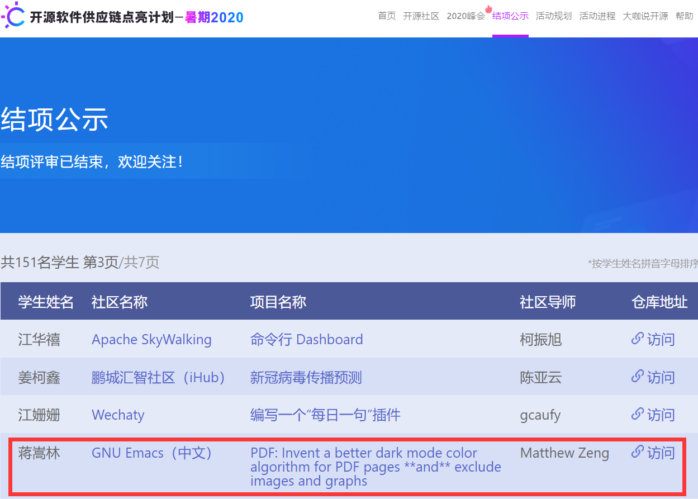

# 我的 开源软件供应链点亮计划——暑期

## 2020 Certificate 证书

## 2021 Certificate 证书

这里是我的"开源软件供应链点亮计划——暑期"活动记录与成果

|  年份   |  申请ID   | 项目ID  | 社区 |  项目名称  |  难度  | 申请人数  |  中选  |  最终选择  |  申请材料 |
|  ----  | ----  |  ----  | ----  | ----  | ----  | ----  | ----  | ----  | ----  |
| [2020](https://isrc.iscas.ac.cn/summer2020/#/started)  | 69 | 2012153  |[*GNU Emacs（中文）*](https://isrc.iscas.ac.cn/summer2020/#/organisations/emacs)|[PDF: Invent a better dark mode color algorithm for PDF pages **and** exclude images and graphs](https://manateelazycat.github.io/eaf/emacs/2020/05/10/eaf-community.html) | 高 | 1 | * | * |[点此访问](2020-41-2020098)|
| [2020](https://isrc.iscas.ac.cn/summer2020/#/started)  | 41 | 2020098  | [*OpenCV China*](https://isrc.iscas.ac.cn/summer2020/#/organisations/opencv) |[Implementation of QR-codes decoder and encoder](http://www.opencv.org.cn/?page_id=411) | 中 | 5 | * |   |[点此访问](2020-69-2012153)|
| [2021](https://summer-ospp.ac.cn/2021/#/?lang=chi)  |   | 210010031  | [*openEuler*](https://summer-ospp.ac.cn/2021/#/org/orgdetail/openeuler?lang=chi) |[开发iso刻录DDE桌面应用](https://summer-ospp.ac.cn/2021/#/org/orgdetail/openeuler/proid210010031?lang=chi) | 高 | 3 | * | * |[点此访问](2021-210010031)|

## 2020

### [EAF浏览器可以支持快捷键选中文本功能了！](https://manateelazycat.github.io/emacs/eaf/2020/07/22/eaf-support-caret-browse.html)

[结项报告](2020-69-2012153/2020-Final-Report.md)，[中期考核导师意见](https://isrc.iscas.ac.cn/gitlab/summer2020/students/proj-2012153/-/issues/22#note_162737)，[结项考核导师意见](https://isrc.iscas.ac.cn/gitlab/summer2020/students/proj-2012153/-/issues/25#note_175301)，[项目地址](https://isrc.iscas.ac.cn/gitlab/summer2020/students/proj-2012153)，[项目Wiki](https://isrc.iscas.ac.cn/gitlab/summer2020/students/proj-2012153/-/wikis/home)，[项目Issue](https://isrc.iscas.ac.cn/gitlab/summer2020/students/proj-2012153/-/issues?scope=all&utf8=%E2%9C%93&state=all)

## [2021结项报告](2021-210010031/2021-Final-Report.md)

# My Open Source Promotion Plan - Summer
This is my work and record under Open Source Promotion Plan - Summer.

|  Year   |  Application ID   | Project ID  | Community |  Project Name  |  Level  | Applicant Number  |  Successful?  |  Selected  |  Application Material  |
|  ----  | ----  |  ----  | ----  | ----  | ----  | ----  | ----  | ----  | ----  |
| [2020](https://isrc.iscas.ac.cn/summer2020/#/started)  | 69 | 2012153  |[*GNU Emacs（China）*](https://isrc.iscas.ac.cn/summer2020/#/organisations/emacs)|[PDF: Invent a better dark mode color algorithm for PDF pages **and** exclude images and graphs](https://manateelazycat.github.io/eaf/emacs/2020/05/10/eaf-community.html) | High | 1 | * | * |[Click to visit](2020-41-2020098)|
| [2020](https://isrc.iscas.ac.cn/summer2020/#/started)  | 41 | 2020098  | [*OpenCV China*](https://isrc.iscas.ac.cn/summer2020/#/organisations/opencv) |[Implementation of QR-codes decoder and encoder](http://www.opencv.org.cn/?page_id=411) | Medium | 5 | * |   |[Click to visit](2020-69-2012153)|
| [2021](https://summer-ospp.ac.cn/2021/#/?lang=en)  |   | 210010031  | [*openEuler*](https://summer-ospp.ac.cn/2021/#/org/orgdetail/openeuler?lang=en) |[Development of ISO writing DDE desktop application](https://summer-ospp.ac.cn/2021/#/org/orgdetail/openeuler/proid210010031?lang=en) | High | 3 | * | * |[Click to visit](2021-210010031)|

## 2020

### [EAF Browser now can support shortcut key to select text!](https://manateelazycat.github.io/emacs/eaf/2020/07/22/eaf-support-caret-browse.html)

[Final Report](2020-69-2012153/2020-Final-Report.md) (Please click the PR links to view details since they are all in English in Github Description)，[Midterm Mentor's Comments](https://isrc.iscas.ac.cn/gitlab/summer2020/students/proj-2012153/-/issues/22#note_162737)，[Final Mentor's Comments](https://isrc.iscas.ac.cn/gitlab/summer2020/students/proj-2012153/-/issues/25#note_175301)，[Project Address](https://isrc.iscas.ac.cn/gitlab/summer2020/students/proj-2012153)，[Project Wiki](https://isrc.iscas.ac.cn/gitlab/summer2020/students/proj-2012153/-/wikis/home)，[Project Issue](https://isrc.iscas.ac.cn/gitlab/summer2020/students/proj-2012153/-/issues?scope=all&utf8=%E2%9C%93&state=all)

## [2021 Final Report (in Chinese)](2021-210010031/2021-Final-Report.md)
